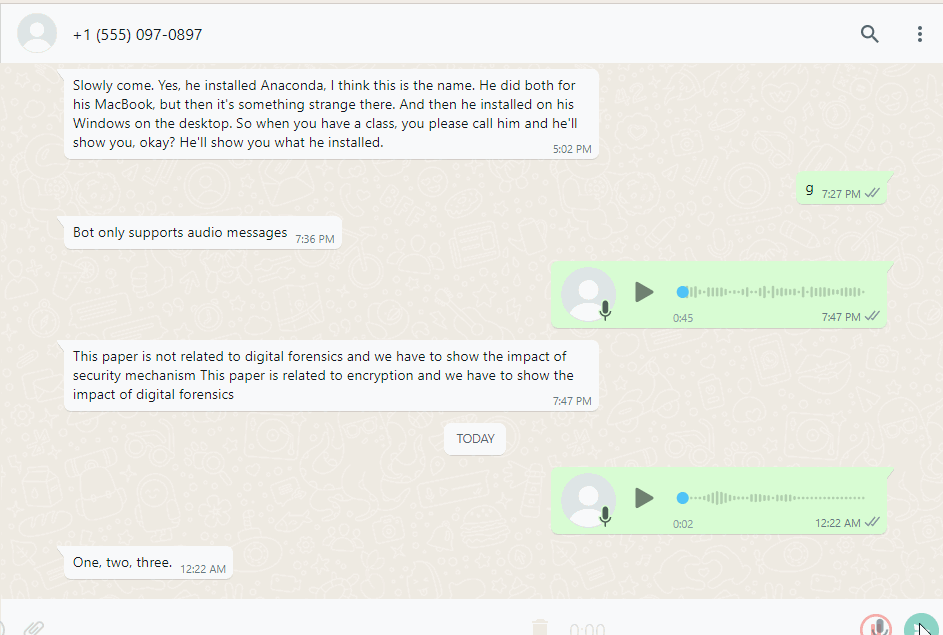
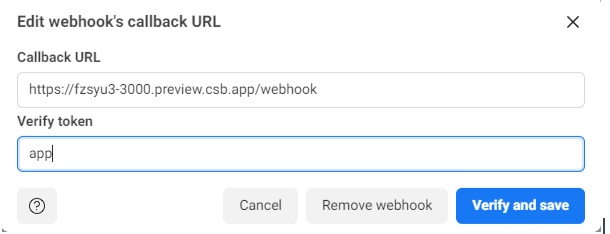

# WhatsApp Voice Magic


## How it works

WhatsApp voice magic is an audio message transcriber app created with APIMatic auto-generated SDKs for [WhatsApp](https://www.apimatic.io/apidocs/whatsapp-api/v/1_0#/http/guides/send-a-message)and [OpenAI Whisper](https://www.apimatic.io/api-docs/whisper-api) API.This voice transcriber bot can transcribe incoming voice messages in WhatsApp to text in real-time, enabling easy communication across languages.

## Running Locally

### Cloning the repository to the local machine.

```bash
git clone https://github.com/mehnoorsiddiqui/whatsapp-voice-magic
```

### Creating a account on Meta to get an API key.

1. Go to [Meta](https://developers.facebook.com/) to make a developer account.
2. Create an App by following the [getting started guide](https://developers.facebook.com/docs/whatsapp/cloud-api/get-started).
3. You can find your Access token from the Meta for Developers site App `Dashboard > WhatsApp > Getting Started`.

### Setting up Webhook URL

To set up webhook on the Meta Developer portal (also enter matching verify token, `app`  in our case). You may use a service like [ngrok](https://ngrok.com/) to make your local app publicly accessible so this webhook can be registered with Whatsapp.
[]

### Storing the API keys in .env
Replace the `WHATSAPP_TOKEN` with your token in the .env file.
Replace the `PHONE_NUMBER_ID` with yours in the .env file.

### Installing the dependencies.
1. Navigate to the OpenAI+Whisper+API directory and run 
```bash
npm install
```
2. Navigate to the WhatsApp+Cloud+API directory and run 
```bash
npm install
```
3. Navigate to the root folder and run 
```bash
npm install
```

### Running the application.

Then, run the application in the command line and it can be tested by sending an audio message to test number given in the developer account.

```bash
npm start
```

## CodeSandbox

1. Fork [this codesandbox](https://codesandbox.io/p/sandbox/whatsapp-voice-magic-lwqrdg) repo.
2. Replace the access token with yours in the .env file.
3. Add the URL of the running sandbox as the webhook URL in the developer account
